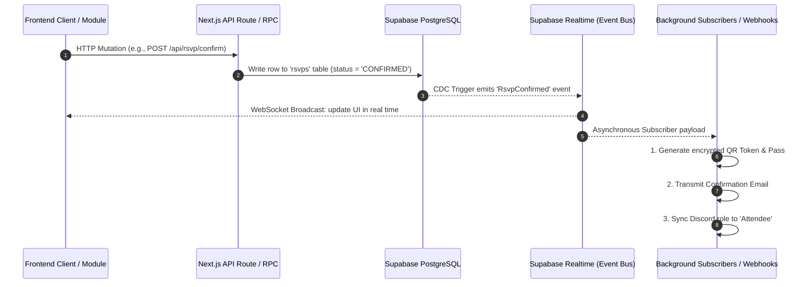
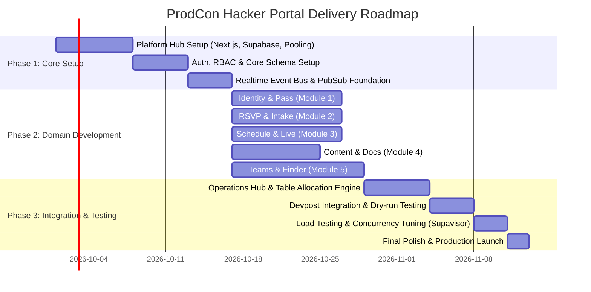

# UWPM ProdCon Hacker Portal — System Architecture Document

> **Document Version:** 1.0.0  
> **Status:** Ready for Engineering & Pod Review  
> **Target Audience:** Engineering Leads, Module Owners, Core Organizers  
> **Source Specification:** `UWPM PROD CON HACKER PORTAL ARCHITECTURE` (Excalidraw Model)

---

## 1. Executive Summary & Architectural Philosophy

The **UWPM ProdCon Hacker Portal** is the centralized digital command center and participant operating system for the University of Waterloo Product Management Club's flagship annual case competition and hackathon.

### Architectural Tenets

1. **Decoupled Ownership & Independent Velocity:**  
   The platform is segmented into five self-contained vertical domain modules (`Identity & Pass`, `RSVP & Intake`, `Schedule & Live`, `Content & Docs`, and `Teams & Finder`). Each module possesses dedicated frontend ownership, discrete API endpoints, distinct data entities, and explicit event triggers.
2. **Event-Driven Asynchrony (Supabase Realtime Event Bus):**  
   Cross-domain communication is strictly mediated via an event bus implemented over Supabase Realtime (Postgres CDC / Broadcast channels). Producers publish domain events; asynchronous workers and decoupled subscribers execute downstream tasks (e.g., Discord syncing, QR ticket generation, table assignments, WebSocket notifications) without blocking synchronous HTTP transactions.
3. **Zero-Custom-Backend Submissions (Devpost Policy):**  
   In compliance with the hackathon submission policy, the portal delegates project submissions, code repository links, demo video hosting, and rubric scoring exclusively to Devpost via authenticated external linkouts. The portal avoids building custom project submission backends or grading engines, eliminating single points of failure during deadline rushes.
4. **Resilient Serverless Infrastructure:**  
   The core platform leverages Next.js App Router deployed on Vercel with preview environments, backed by Supabase Managed PostgreSQL with Supavisor transaction/session connection pooling (`port 6543`) to safely handle high-concurrency traffic bursts during registration drops and live announcements.

---

## 2. System Topology & Architecture Diagram

```mermaid
flowchart TD
    subgraph ParticipantExperience["Participant Experience (Web Platform)"]
        direction TB
        subgraph TopRow["Core User Workflows"]
            P_Home["Home: Happening Now<br/>• Live countdown & stage<br/>• Activity banner<br/>• Broadcast feed"]
            P_RSVP["RSVP & Applications<br/>• Dynamic form<br/>• Status tracker<br/>• Dietary & waiver"]
            P_Schedule["Schedule & Timeline<br/>• Filterable agenda<br/>• Keynotes & drops"]
            P_Teams["Find Teammates & Teams<br/>• Skill search directory<br/>• 6-char join codes<br/>• Confirmed roster"]
            P_Profile["My Profile & Pass<br/>• Attendee badge & QR<br/>• Social handles"]
        end

        subgraph BottomRow["Informational, Content & External Workflows"]
            P_Booklet["Welcome Booklet<br/>• Organizer info<br/>• Sponsors & tracks"]
            P_HowItWorks["How It Works<br/>• Hackathon rules & CoC<br/>• Milestone cutoffs<br/>• Devpost guide"]
            P_FAQ["FAQ & Support<br/>• Search directory<br/>• Discord invite link<br/>• Mentor helpdesk link"]
            P_Feedback["Feedback & Ratings<br/>• Mid-event pulse<br/>• Post-event review"]
            P_Devpost["External Devpost Link (Dashed)<br/>• Direct linkout<br/>• Submissions & videos<br/>• Zero custom backend"]
        end
    end

    subgraph PlatformLayer["Platform & Infrastructure Orchestration"]
        PlatformHub["Lead Architect: Platform Hub<br/>• Supabase Postgres & Auth<br/>• Next.js App Router on Vercel<br/>• Supavisor Connection Pooling (:6543)<br/>• Storage Bucket & Signed URLs"]

        EventBus["Internal Event Bus (Supabase Realtime)<br/>• UserRegistered -> Welcome email & Discord sync<br/>• RsvpConfirmed -> Digital pass & QR generation<br/>• ScheduleAlert -> Instant WebSocket banner<br/>• TeamLocked -> Table assignment notification"]

        OpsHub["Operations & Logistics Hub<br/>• Table & floor allocation engine<br/>• Real-time check-in engine"]
    end

    subgraph DomainModules["Modular Engineering Tracks (Pod Ownership)"]
        direction LR
        M1["[NAME] Identity & Pass<br/>• Supabase Auth / RBAC<br/>• Profiles & QR Scans<br/>• Emits: UserRegistered, UserCheckedIn"]
        M2["[NAME] RSVP & Intake<br/>• Dynamic form (jsonb)<br/>• Resumes & Status<br/>• Emits: ApplicationSubmitted, RsvpConfirmed"]
        M3["[NAME] Schedule & Live<br/>• Timeline & Active Stage<br/>• Urgent Broadcast Alerts<br/>• Emits: ScheduleAlert, BroadcastPushed"]
        M4["[NAME] Content & Docs<br/>• Markdown CMS & FAQs<br/>• Workshop Ratings<br/>• Emits: FeedbackSubmitted"]
        M5["[NAME] Teams & Finder<br/>• Member Directory<br/>• 6-char Team Codes & Roster<br/>• Helpdesk Queue<br/>• Emits: TeamFormed, HelpdeskTicketOpened"]
    end

    %% Connections
    PlatformHub --> EventBus
    EventBus --> OpsHub

    %% Upward Dashed Event Emissions from Modules to Event Bus
    M1 -.->|Emits Events| EventBus
    M2 -.->|Emits Events| EventBus
    M3 -.->|Emits Events| EventBus
    M4 -.->|Emits Events| EventBus
    M5 -.->|Emits Events| EventBus

    %% Frontends mapped to modules
    P_Profile -.-> M1
    P_RSVP -.-> M2
    P_Home -.-> M3
    P_Schedule -.-> M3
    P_Booklet -.-> M4
    P_HowItWorks -.-> M4
    P_FAQ -.-> M4
    P_Feedback -.-> M4
    P_Teams -.-> M5
```



---

## 3. Participant Experience (Web Platform)

The web platform is an adaptive, single-page application built on the Next.js App Router, featuring real-time state synchronization via WebSockets.

### 3.1 Primary Views & User Workflows

| View                       | Purpose & Core Capabilities                                                                                                                                                                                                                                                                                              | Interacting Service / Module        |
| :------------------------- | :----------------------------------------------------------------------------------------------------------------------------------------------------------------------------------------------------------------------------------------------------------------------------------------------------------------------- | :---------------------------------- |
| **Home: Happening Now**    | Real-time countdown timer to current phase (Hacking, Submissions, Pitches); live status badge; persistent broadcast alert banner for emergency notifications; active event ticker.                                                                                                                                       | `Schedule & Live`                   |
| **RSVP & Applications**    | Multi-step intake questionnaire rendered dynamically from JSON schema definitions; real-time application status tracker (`Draft` $\rightarrow$ `Submitted` $\rightarrow$ `Under Review` $\rightarrow$ `Accepted` $\rightarrow$ `Waitlisted` $\rightarrow$ `Confirmed`); dietary, liability, and photo waiver acceptance. | `RSVP & Intake`                     |
| **Schedule & Timeline**    | Interactive, filterable schedule agenda. Filter by track, workshop type, keynote, meal/food drops, and judging rounds. Features local timezone detection and calendar sync export (.ics).                                                                                                                                | `Schedule & Live`                   |
| **Find Teammates & Teams** | Filterable attendee directory (searchable by role, technical skills, interests, and year); self-serve team creation generating unique 6-character alphanumeric join codes; team roster inspection and invitation acceptance.                                                                                             | `Teams & Finder`                    |
| **My Profile & Pass**      | Hacker digital identity pass containing participant name, track, avatar, dietary tags, social links (GitHub, LinkedIn, Instagram, Portfolio), and a cryptographically signed QR badge for in-person hardware and meal verification.                                                                                      | `Identity & Pass`                   |
| **Welcome Booklet**        | Digital event guide containing organizer leadership bios, participating sponsors, API perks, workshop collateral, and special track challenges.                                                                                                                                                                          | `Content & Docs`                    |
| **How It Works**           | Comprehensive guide covering competition rules, code of conduct, intellectual property policies, milestone schedule deadlines, and official submission rubrics.                                                                                                                                                          | `Content & Docs`                    |
| **FAQ & Support**          | Full-text searchable directory of frequently asked questions, direct link to join the UWPM Discord guild, and quick-dispatch trigger for the mentor helpdesk.                                                                                                                                                            | `Content & Docs` / `Teams & Finder` |
| **Feedback & Ratings**     | Mid-hackathon pulse check survey and post-event comprehensive organizer review to capture participant NPS and operational feedback.                                                                                                                                                                                      | `Content & Docs`                    |
| **External Devpost Link**  | Dedicated, prominent external gateway for hackathon project submissions, GitHub links, demonstration video links, and judge scoring.                                                                                                                                                                                     | External (Devpost)                  |

### 3.2 Devpost Submission Policy

> **Policy Directive:** Direct External Submissions (Zero Custom API Integration)
>
> - **Rationale:** Building custom file uploaders, video hosting, and multi-round judging portals introduces critical failure modes during competition crunch hours.
> - **Implementation:** The portal provides deep links to the official ProdCon Devpost portal with clear deadline countdowns and pre-flight submission checklists. No custom database models or APIs exist for repository storage, demo video uploads, or project scorecards.

---

## 4. Platform Hub & Infrastructure Specifications

The Lead Architect oversees the foundational core infrastructure that hosts, connects, and protects all upstream modules.

### 4.1 Infrastructure Matrix

- **Frontend & Edge Hosting:** Vercel Pro (Next.js App Router, Edge Middleware for JWT validation and route protection, automatic Preview Deployments per pull request).
- **Database & BaaS:** Supabase Managed PostgreSQL 15+.
- **Connection Pooling:** **Supavisor** running in transaction and session pooling mode on `port 6543` to avoid exhausting PostgreSQL client connection limits under sudden spikes.
- **Storage Engine:** Supabase S3-compatible Object Storage with dedicated buckets:
  - `resumes/`: Private bucket with strict pre-signed URL policies (TTL: 15 minutes, accessible only by applicants and verified reviewers).
  - `avatars/`: Public bucket with WebP image transformation and 2MB upload limit.
  - `static-assets/`: Public CDN cache for booklets, sponsor decks, and guidelines.

### 4.2 Security, Auth & RBAC

- **Authentication Strategies:**
  - Passwordless Magic Link via transactional SMTP.
  - OAuth 2.0 (GitHub and Google providers).
- **Role-Based Access Control (RBAC):**
  - Roles: `hacker`, `applicant`, `mentor`, `reviewer`, `admin`, `super_admin`.
  - Claims are embedded directly into the Supabase Auth JWT and verified using Postgres Row-Level Security (RLS) policies.

---

## 5. Internal Event Bus (Supabase Realtime)

The core nervous system of the platform is an asynchronous event bus running over Supabase Realtime (PostgreSQL Logical Replication & Broadcast channels).



### 5.1 Event Catalog

| Event Name             | Emitting Domain Module | Downstream Subscribers & Side Effects                                                                          |
| :--------------------- | :--------------------- | :------------------------------------------------------------------------------------------------------------- |
| `UserRegistered`       | `Identity & Pass`      | Dispatches welcome email; triggers background Discord bot to map user tag and grant `@Hacker` role.            |
| `ApplicationSubmitted` | `RSVP & Intake`        | Indexes applicant into Reviewer Scoring queue; sends confirmation receipt to user.                             |
| `RsvpConfirmed`        | `RSVP & Intake`        | Invokes digital badge generation service; creates signed QR check-in payload; provisions attendee pass.        |
| `ScheduleAlert`        | `Schedule & Live`      | Transmits instantaneous WebSocket broadcast payload across all active client browsers to render urgent banner. |
| `BroadcastPushed`      | `Schedule & Live`      | Pushes push notification / Discord announcement channel message; logs message to audit trail.                  |
| `TeamFormed`           | `Teams & Finder`       | Locks team configuration if team reaches capacity (4 members); alerts Table Allocation Engine.                 |
| `TeamLocked`           | `Teams & Finder`       | Operations Hub calculates room/table capacity and assigns physical table coordinate.                           |
| `HelpdeskTicketOpened` | `Teams & Finder`       | Alerts active mentors via Discord ticket bot with table number, topic, and requester profile.                  |
| `UserCheckedIn`        | `Identity & Pass`      | Increments live check-in counters; unlocks meal claim allowances in scanner UI.                                |
| `FeedbackSubmitted`    | `Content & Docs`       | Normalizes NPS response and streams metrics to organizer analytics dashboard.                                  |

---

## 6. Operations & Logistics Hub

The Operations & Logistics Hub operates as the administrative control center used by organizers during the physical event.

### 6.1 Real-Time Check-In & Scanner Engine

- **Camera / Hardware Scanner Support:** HTML5 camera QR reader accessible from mobile browsers for registration volunteers.
- **Scan Verification:** Verifies cryptographically signed QR tokens against the `users` and `checkin_scans` entities.
- **Meal & Swag Tracking:** Ensures one meal per badge per meal window (Breakfast, Lunch, Dinner, Midnight Snack) with duplicate scan prevention.

### 6.2 Table & Floor Allocation Engine

- **Capacity Rules:** Allocates tables based on confirmed team rosters (2 to 4 hackers per table).
- **Track Clustering:** Groups teams opting into specific sponsor hardware tracks adjacent to sponsor mentor pods.
- **Real-time Table Mapping:** When `TeamLocked` is emitted, assigns the next available table identifier (e.g., `E7-2401-Table-14`) and updates the team dashboard instantly.

---

## 7. Modular Engineering Tracks & Ownership Specs

To ensure clean engineering boundaries and avoid merge conflicts, work is divided across five domain tracks. Each track owner is responsible for the end-to-end delivery of their vertical (UI, Server Actions / API Routes, Data Models, and Event Emitters).

---

### Module 1: `[NAME]` Identity & Pass

- **Frontend Ownership:**
  - `src/app/(portal)/profile/page.tsx` (Attendee Profile Management)
  - `src/components/pass/DigitalPass.tsx` (Interactive Badge & QR Pass)
  - `src/app/(admin)/scanner/page.tsx` (Organizer QR Check-in & Meal Scanner)
- **Core Responsibilities:**
  - Supabase Auth integration (Magic links, Google/GitHub OAuth, session refreshes).
  - Role-Based Access Control (RBAC) middleware.
  - Attendee profile curation (biography, skills, GitHub, LinkedIn, portfolio links).
  - Fast QR code scanner with offline-first caching for high-speed physical check-in.
- **API Contracts:**
  - `POST /api/auth/magic-link`: Initiates passwordless authentication.
  - `GET /api/users/me/profile`: Fetches authenticated user profile, pass credentials, and QR signature.
  - `POST /api/admin/checkin`: Validates scanned QR token, logs scan timestamp, updates check-in status.
- **Data Entities (PostgreSQL):**
  - `users` (Managed by Supabase Auth: `id`, `email`, `created_at`).
  - `profiles` (`id` references `auth.users`, `full_name`, `avatar_url`, `bio`, `school`, `grad_year`, `github_handle`, `linkedin_url`, `role`, `updated_at`).
  - `checkin_scans` (`id`, `user_id`, `scanned_by`, `scan_type` [Registration, Lunch, Dinner], `scanned_at`).
- **Events Emitted:**
  - `UserRegistered`
  - `UserCheckedIn`

---

### Module 2: `[NAME]` RSVP & Intake

- **Frontend Ownership:**
  - `src/app/(portal)/apply/page.tsx` (Dynamic Application Form)
  - `src/app/(portal)/rsvp/page.tsx` (RSVP Confirmation & Waiver Portal)
  - `src/app/(admin)/review/page.tsx` (Reviewer Scoring & Decision Dashboard)
- **Core Responsibilities:**
  - Dynamic questionnaire builder rendering forms from JSON Schema specifications.
  - Secure resume upload via Supabase Storage pre-signed URL generation.
  - Application state machine (`DRAFT` $\rightarrow$ `SUBMITTED` $\rightarrow$ `IN_REVIEW` $\rightarrow$ `ACCEPTED` $\rightarrow$ `CONFIRMED` $\rightarrow$ `DECLINED`).
  - Reviewer scoring matrix and batch decision tools.
- **API Contracts:**
  - `POST /api/applications/apply`: Submits completed application questionnaire with JSON payload.
  - `POST /api/resumes/upload-url`: Generates secure S3 pre-signed upload URL for PDF resume files.
  - `POST /api/rsvp/confirm`: Records hacker attendance confirmation, dietary requirements, and waiver acceptance.
- **Data Entities (PostgreSQL):**
  - `applications` (`id`, `user_id`, `form_data` [JSONB], `status`, `reviewer_score`, `created_at`, `submitted_at`).
  - `resumes` (`id`, `user_id`, `storage_path`, `uploaded_at`).
  - `rsvps` (`id`, `user_id`, `attending` [BOOLEAN], `dietary_restrictions`, `tshirt_size`, `emergency_contact`, `waiver_agreed`, `confirmed_at`).
- **Events Emitted:**
  - `ApplicationSubmitted`
  - `RsvpConfirmed`

---

### Module 3: `[NAME]` Schedule & Live

- **Frontend Ownership:**
  - `src/app/(portal)/home/page.tsx` (Happening Now live dashboard)
  - `src/app/(portal)/schedule/page.tsx` (Interactive Filterable Schedule)
  - `src/components/live/BroadcastBanner.tsx` (Real-time announcement banner component)
  - `src/app/(admin)/broadcast/page.tsx` (Admin Emergency Alert Dispatcher)
- **Core Responsibilities:**
  - Synchronized countdown timer tied to hackathon milestones (Hacking Start, Lunch Drop, Soft Deadline, Hard Deadline).
  - Filterable agenda timeline with multi-tag support (Keynote, Workshop, Meal, Activity, Sponsor).
  - High-priority broadcast push notifications delivering urgent alerts to active hackers.
  - Persistent WebSocket subscription to Supabase Realtime channel for zero-refresh updates.
- **API Contracts:**
  - `GET /api/live/status`: Returns current active stage, countdown target, and latest active broadcast alert.
  - `GET /api/schedule/events`: Returns full list of schedule items with filtering tags and locations.
  - `POST /api/admin/broadcast`: Admin-only endpoint to issue an instant push announcement across all clients.
- **Data Entities (PostgreSQL):**
  - `schedule_items` (`id`, `title`, `description`, `location`, `start_time`, `end_time`, `category`, `is_active`).
  - `announcements` (`id`, `author_id`, `title`, `message`, `priority` [Normal, Urgent], `created_at`, `expires_at`).
- **Events Emitted:**
  - `ScheduleAlert`
  - `BroadcastPushed`

---

### Module 4: `[NAME]` Content & Docs

- **Frontend Ownership:**
  - `src/app/(portal)/booklet/page.tsx` (Digital Welcome Booklet)
  - `src/app/(portal)/how-it-works/page.tsx` (Rules, Guidelines & Devpost Guide)
  - `src/app/(portal)/faq/page.tsx` (Searchable FAQ Directory)
  - `src/app/(portal)/feedback/page.tsx` (Participant Pulse & Post-Event Survey)
- **Core Responsibilities:**
  - Lightweight Markdown/MDX content pipeline for event guides, sponsor listings, and competition rules.
  - Client-side fuzzy search indexing for rapid FAQ resolution.
  - Structured survey collector for workshop-specific 1-to-5 star ratings.
  - Comprehensive post-event feedback collation and NPS data capture.
- **API Contracts:**
  - `GET /api/content/booklet`: Returns structured markdown sections and sponsor partner data for the welcome booklet.
  - `GET /api/faq`: Retrieves categorized FAQ question and answer entries.
  - `POST /api/feedback/submit`: Ingests ratings, open-ended feedback, and participant sentiment.
- **Data Entities (PostgreSQL):**
  - `content_docs` (`id`, `slug`, `title`, `content_md`, `version`, `updated_at`).
  - `faqs` (`id`, `category`, `question`, `answer_md`, `display_order`).
  - `feedback` (`id`, `user_id`, `survey_type` [MidEvent, PostEvent], `ratings` [JSONB], `comments`, `created_at`).
- **Events Emitted:**
  - `FeedbackSubmitted`

---

### Module 5: `[NAME]` Teams & Finder

- **Frontend Ownership:**
  - `src/app/(portal)/teams/finder/page.tsx` (Participant Directory & Teammate Search)
  - `src/app/(portal)/teams/manage/page.tsx` (Team Creation, Code Sharing, and Roster View)
  - `src/app/(portal)/helpdesk/page.tsx` (Hacker Helpdesk & Mentor Queue)
- **Core Responsibilities:**
  - Participant skills directory with full-text search and filtering by desired project track.
  - Collision-resistant 6-character alphanumeric team join code generation and validation.
  - Team roster rules enforcement (strict minimum 2, maximum 4 members per team).
  - Real-time helpdesk ticketing system connecting teams directly with roving mentors.
- **API Contracts:**
  - `GET /api/participants/find`: Searches looking-for-team attendees by skill set, school, and interest tags.
  - `POST /api/teams/create`: Initializes new team entity and generates unique 6-character invite code.
  - `POST /api/teams/join`: Validates invite code, checks team capacity limit, and appends user to team roster.
  - `POST /api/helpdesk/ticket`: Dispatches help request with table number, technology stack, and issue description.
- **Data Entities (PostgreSQL):**
  - `participants` (View/extension of `profiles`: `user_id`, `skills` [TEXT[]], `interests` [TEXT[]], `is_looking_for_team`).
  - `teams` (`id`, `name`, `join_code` [VARCHAR(6), UNIQUE], `table_number`, `is_locked`, `created_at`).
  - `team_members` (`id`, `team_id`, `user_id`, `joined_at`, UNIQUE(`user_id`)).
  - `mentor_tickets` (`id`, `team_id`, `requester_id`, `table_number`, `category`, `description`, `status` [Open, InProgress, Resolved], `claimed_by`, `created_at`).
- **Events Emitted:**
  - `TeamFormed`
  - `TeamLocked`
  - `HelpdeskTicketOpened`

---

## 8. Database Schema Blueprint & Row-Level Security (RLS)

All tables must enforce strict PostgreSQL Row-Level Security (RLS) policies using Supabase Auth claims.

```sql
-- Schema & Policy Blueprint for Core Tables

-- 1. Profiles Table
CREATE TABLE public.profiles (
  id UUID REFERENCES auth.users(id) PRIMARY KEY,
  full_name TEXT NOT NULL,
  avatar_url TEXT,
  bio TEXT,
  skills TEXT[] DEFAULT '{}',
  role TEXT DEFAULT 'hacker' CHECK (role IN ('hacker', 'admin')),
  created_at TIMESTAMPTZ DEFAULT timezone('utc'::text, now()) NOT NULL,
  updated_at TIMESTAMPTZ DEFAULT timezone('utc'::text, now()) NOT NULL
);

ALTER TABLE public.profiles ENABLE ROW LEVEL SECURITY;

CREATE POLICY "Public profiles are viewable by authenticated users"
  ON public.profiles FOR SELECT
  TO authenticated
  USING (true);

CREATE POLICY "Users can edit their own profile"
  ON public.profiles FOR UPDATE
  TO authenticated
  USING (auth.uid() = id);

-- 2. Teams Table
CREATE TABLE public.teams (
  id UUID DEFAULT gen_random_uuid() PRIMARY KEY,
  name TEXT NOT NULL,
  join_code VARCHAR(6) UNIQUE NOT NULL,
  table_number TEXT,
  is_locked BOOLEAN DEFAULT false,
  created_at TIMESTAMPTZ DEFAULT timezone('utc'::text, now()) NOT NULL
);

ALTER TABLE public.teams ENABLE ROW LEVEL SECURITY;

CREATE POLICY "Teams viewable by authenticated users"
  ON public.teams FOR SELECT
  TO authenticated
  USING (true);

-- 3. Team Members Table (Max 4 members enforcement via trigger)
CREATE TABLE public.team_members (
  id UUID DEFAULT gen_random_uuid() PRIMARY KEY,
  team_id UUID REFERENCES public.teams(id) ON DELETE CASCADE NOT NULL,
  user_id UUID REFERENCES public.profiles(id) ON DELETE CASCADE UNIQUE NOT NULL,
  joined_at TIMESTAMPTZ DEFAULT timezone('utc'::text, now()) NOT NULL
);

ALTER TABLE public.team_members ENABLE ROW LEVEL SECURITY;

CREATE POLICY "Team members viewable by authenticated users"
  ON public.team_members FOR SELECT
  TO authenticated
  USING (true);
```

---

## 9. Implementation Milestones & Delivery Roadmap



---

## 10. Summary Checklist for Track Owners

When starting work on your assigned module, verify the following checklist:

- [ ] Ensure all database queries route through Supavisor pooled connection (`port 6543`).
- [ ] Apply Postgres Row-Level Security (RLS) policies to every new table.
- [ ] Implement typed API response contracts with standardized error payloads (`{ error: string, code: string }`).
- [ ] Avoid writing custom project submission logic; direct users to official Devpost links.
- [ ] Publish appropriate events over Supabase Realtime instead of directly mutating cross-domain tables.
- [ ] Implement responsive UI layouts tested on mobile (`< 768px`), tablet (`768px - 1024px`), and desktop (`> 1024px`).
